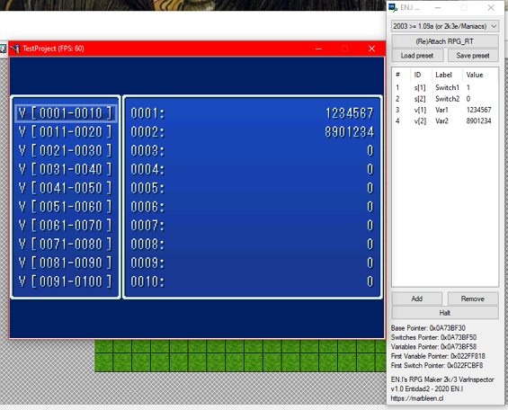

# EN.I RPG Maker 2000/2003 Variable Inspector
As name said, this is a simple tool made for inspecting switches and variables in realtime. This come handy when you are making engines or some sort of other complex events that requires to have a live-tracking of switches/variable values (without having to press F9 many times or putting debug messages everywhere to track values).

## Download
You can download last version in [Releases](https://github.com/elsemieni/RPGMaker2k3VarInspector/releases) section. 
## Instructions
Basic instructions are following.

 - Select your version of RPG_RT of your game that you will use with this tool.
 - Execute your game and set a switch and a variable before. That's important beacuse without setting them the tool will be unable to detect the executable(*).
 - Click on (Re)Attach RPG_RT to connect the tool to the RPG_RT process.
 - Start adding variables and/or switches that you want to live inspect.

By tool limitations you must add the switches/variables that you want to see. You can do it with Add button. Also you can save your variable listings for future use (so you can setup your watches once). 

(*) RPG_RT does not initialize variables at bootup, instead it only creates it when you set a one, until that value. That means if you set Variable ID 100, the program will just initialize variables from 1 to 100. So, for using variable 1000 you must initialize first by setting a value on it (or in a higher variable ID). If you don't initalize it you will see random values on it (and if you don't initialize any variable you will get an error beacuse the tool will be unable to locate them).

## Supported RPG_RT versions

 - RPG Maker 2003 1.09a and futher. This includes official english releases (1.09a based).
 - RPG Maker 2003 1.08. That included DynRPG patched executables.
 - RPG Maker 2003 1.03.
 - RPG Maker 2000 1.16 (English release).
 - RPG Maker 2000 1.51 Value!
 - RPG Maker 2000 1.07 (known as PRO in some spanish communities).

RPG Maker XP, VX(Ace) and MV are **NOT** supported (it will not be too hard making an script for mimic the functionality of this tool). EasyRPG Player is not supported either.  

## Building
This tool was made using [AutoIt v3](https://www.autoitscript.com/). For building, please use enhanced version of SciTE editor, and compile rpgmaker2k3varinspector.au3 for x86. This is important, beacuse the executable need to proper communicate with RPG_RT process, which is a 32 bit based executable. 

## License
This tool is licensed under **MIT license** (see LICENSE), and their usage is under compilance of [official RPG Maker 2003 Patch EULA](https://s3-ap-northeast-1.amazonaws.com/degica-prod.product-files/43028/rm2003-patch-eula.doc). 

This tool uses the NormadMemory UDF library, by Normad. 

## What is Entidad2?
Sincerely I have no idea... 🤷
